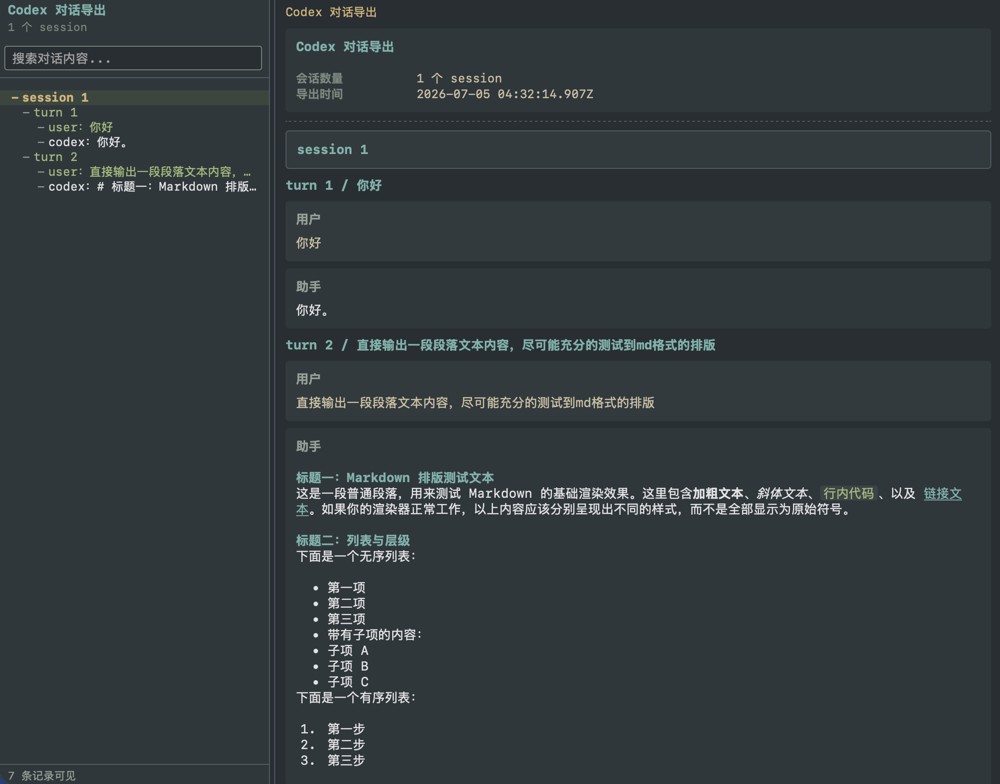

# codex-session-export-cli

一个将本机 Codex session id 导出为可视化 HTML 的跨平台 CLI，支持完整导出和仅对话导出。

下图由 session `019f3089-fab3-78e0-a4f2-caa4a0293735` 使用 `-chat_only` 生成：



## 快速开始

1. 确认本机已经安装 Python 3.7+ 和 Node.js。
2. 在仓库目录运行配置检查：

```bash
python3 codex-session-export.py -doctor
```

3. HTML 样式参考了开源项目 [feynman](https://github.com/companion-inc/feynman)，导出时输入 Codex session id，并用 `-output` 指定输出文件：

```bash
python3 codex-session-export.py <session-id> -chat_only -output ./session.html
```

## 命令格式

```bash
# 完整导出
python3 codex-session-export.py <session-id> -output <输出html路径>

# 仅导出对话内容，适合分享
python3 codex-session-export.py <session-id> -chat_only -output <输出html路径>

# 只检查 Python、Node.js、JS 生成器和 Codex session 目录
python3 codex-session-export.py -doctor

# 检查配置，并确认指定 session 可以找到
python3 codex-session-export.py <session-id> -doctor

# 查看帮助
python3 codex-session-export.py -help
```

## 致谢

本项目的 HTML 展示样式参考了 [companion-inc/feynman](https://github.com/companion-inc/feynman) 的 session export 视觉风格，并在此基础上适配 Codex session 的数据结构与导出需求。

## 新增：ChatGPT 网页端数据导出处理

新增 `chatgpt-history-export.py` 和 `generate-chatgpt-history-html.js`，用于读取 ChatGPT 网页端数据导出目录中的 `conversations-*.json`、`conversation_asset_file_names.json`、`library_files.json` 和本地 `file_*.dat` 附件，生成可离线浏览的历史对话 HTML。

```bash
python3 chatgpt-history-export.py <ChatGPT导出文件夹路径> -output <输出html路径>
```
